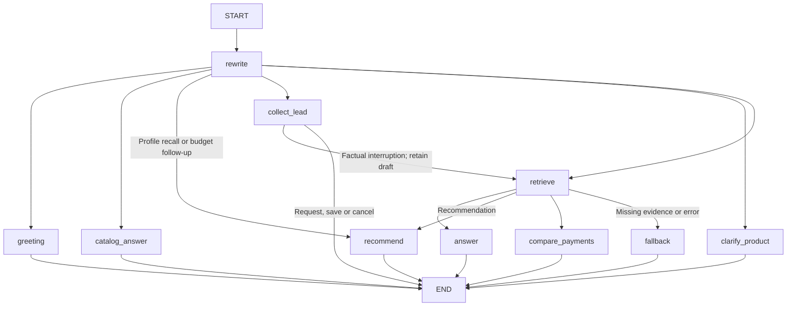

# InsureX Sales Agent Assistant

An AI assistant for sales staff to answer insurance questions from five supplied Thai PDF brochures and collect customer leads as structured records.

**Objective:** ให้ผู้สมัครออกแบบและพัฒนาระบบ AI Agent สำหรับช่วยเหลือพนักงานขาย (Sales Agent) โดยระบบต้องสามารถตอบคำถามจากฐานความรู้ที่มีอยู่ และมีฟังก์ชันพิเศษในการเก็บข้อมูลลูกค้า (Lead Collection) อย่างเป็นระบบ

Built with **LangChain**, **LangGraph**, **FAISS** and **SQLite**, with a local browser interface and an optional terminal interface. English and Thai questions are supported. This README is the setup and usage guide.

## Windows setup

Tested with Python **3.12**. Install it if needed; the ZIP contains neither a virtual environment nor a private API key.

1. Extract `insurex-rag.zip` completely.
2. Open the extracted `insurex-rag` folder in File Explorer. Click the address bar, type `powershell`, and press Enter to open PowerShell in that folder.
3. Create the environment and install the tested dependency versions:
4. py -3.12 -m venv. venv is just an example use -py with your version of python!

```powershell
py -3.12 -m venv .venv
.\.venv\Scripts\python.exe -m pip install -r requirements.lock.txt
if (-not (Test-Path .env)) { Copy-Item .env.example .env }
```

`requirements.txt` also lists direct dependencies with version ranges. The lock file reproduces the tested dependency versions.

4. Edit the new `.env` file and add your own OpenAI API key with API credit. Keep `.env.example` as the reusable template:

```dotenv
OPENAI_API_KEY=your-api-key
CHAT_MODEL=gpt-4.1-mini
EMBEDDING_MODEL=text-embedding-3-small
TOP_K=5
CHUNK_SIZE=1000
CHUNK_OVERLAP=150
```

5. Double-click **Start Chatbot.cmd**. It opens the browser and runs the app in the background. VS Code is optional.

**The ZIP includes the five PDFs and their matching FAISS index; no initial ingestion is required.** For a source-only GitHub clone, copy the assessment PDFs into `data/pdfs/` and build the index with the ingestion command below if it is absent. PDFs and local storage are ignored by Git.

Online answers and lead extraction use API credit. Ingestion sends extracted text for embeddings; online chat sends relevant brochure evidence and conversation information to OpenAI. Choose **Offline catalog** for basic listings and payment terms without API calls. Detailed answers, recommendations and extraction require online mode. Viewing saved information needs no API calls.

## Browser controls

- **New conversation:** create a separate conversation ID for another customer.
- **Conversation:** select a saved ID to restore messages and state.
- **Saved information → Conversations:** inspect remembered details and history, then resume the selected chat or unfinished lead.
- **Saved information → Leads:** search completed leads by name, phone or product, filter by conversation, inspect all contact fields, open the linked chat, or download displayed records as JSON.
- **Refresh saved information:** reload records added elsewhere in the same instance.

Use **Stop Chatbot.cmd** then **Start Chatbot.cmd** after code or `.env` changes. Closing a browser tab alone leaves the app running. The launcher selects a free port from **8501–8599**; repeated Start reopens the normal running instance. **New Chatbot Instance.cmd** creates a fresh instance with separate port and storage under `storage/browser-instances/<instance-id>/data/`. The interface lists only its current instance's records.

To reopen an older separate instance's saved data, stop the app, then launch manually from the project folder using that directory and an available port:

```powershell
$env:INSUREX_UI_STORAGE_DIR = (Resolve-Path 'storage/browser-instances/YOUR-INSTANCE-ID/data').Path
.\.venv\Scripts\python.exe -m streamlit run app.py --server.port 8510
```

Remove that setting before returning to normal storage: `Remove-Item Env:INSUREX_UI_STORAGE_DIR`.

The app binds to `127.0.0.1`. Local conversation IDs and ports separate contexts; they are not authentication. Public hosting would require authentication and access controls.

## Knowledge base and recommendations

| Product | Brochure prefix | Purpose |
|---|---|---|
| Khum Cheeva / คุ้มชีวา | `02_` | Whole life with eligible rider attachments |
| Khum Bamnan / คุ้มบำนาญ | `05_` | Pension |
| Khum Raksa Maojai Extra / คุ้มรักษา เหมาจ่าย เอ็กซ์ตร้า | `07_` | Health rider |
| Khum Aomsook / คุ้มออมสุข | `09_` | Savings |
| Khum Talodcheep CI Plus / คุ้มตลอดชีพ ซีไอ พลัส | `11_` | Life and critical illness |

FAISS stores brochure embeddings; detailed answers cite PDF names and pages. Named comparisons reconstruct relevant indexed pages for each named product. Reviewed catalog fields and table notes keep coverage, payment periods, rider conditions and worked examples separate. Missing evidence prompts clarification or a limitation. Retrieval/model errors produce explicit fallback responses.

Recommendations use the customer's stated goal and published entry-age ranges. Words such as frugal, poor, medium mass or affluent do not establish budget or eligibility. Broad “protection” is clarified among death benefits, illness cash and medical bills. Matching quotes are needed to verify affordability for the actual profile, benefit amount, payment term and required riders.

The name **CI 50** does not establish fifty covered illnesses. The supplied Cheeva pages contain benefit examples but incomplete illness definitions. A focused validation check rejects the observed unsupported count claim and allows one repair attempt. Citations and these safeguards do not prove every future answer correct.

PDF hashes bind the catalog and index to the reviewed sources. Adding/replacing/removing PDFs requires reviewing product facts, benefit/eligibility notes and recommendation rules, then rebuilding FAISS. Changing the embedding model also requires re-indexing. Changing only a compatible chat model does not.

## Bonus Task 1: structured lead collection

This implements the **Tooling** option using Pydantic models and the LangChain `save_insurance_lead` tool. An MCP transport server is not included.

Explicit product interest triggers collection mode. Try synthetic details:

```text
I am interested in Khum Cheeva.
My name is Demo Alex. I am a student. My income is 20,000 THB per month.
My contact number is 0800000000.
```

The agent requests missing **name, occupation, income and contact number**, plus an unambiguous product. Each field must have supporting human-message evidence. A premium budget is not income. Phone numbers remain strings with leading zeroes; format validation requires 8–15 digits. Income preserves the supplied amount, currency and frequency as text.

Complete validated records are written to SQLite and success is confirmed only after the tool reports a save. `/cancel-lead` cancels an incomplete draft without creating a completed lead. Factual interruptions retain the draft. Repeated writes with the same lead/session ID update that row. Database paths come from configuration and SQL queries use parameters.

Example structured fields (the complete record also includes `lead_id` and exact `evidence` quotations):

```json
{
  "session_id": "demo-a",
  "product_id": "cheeva",
  "name": "Demo Alex",
  "occupation": "student",
  "income": "20,000 THB per month",
  "contact_number": "0800000000"
}
```

Saving interest is not an insurance application or a coverage confirmation. See [the tool guide](demo/lead-collection-guide.md) and [actual demo output](demo/submission-demo.md).

## Bonus Task 2: session management

LangGraph's SQLite checkpointer uses the conversation ID as `thread_id`. Reusing it restores messages, customer profiles and unfinished lead drafts after restarting. Different IDs keep independent contexts. An explicit switch to another customer establishes an extraction boundary inside the same conversation.

| Default local path | Stored information |
|---|---|
| `storage/sessions.sqlite` | LangGraph checkpoints, messages, profiles and drafts |
| `storage/leads.sqlite` | Completed leads and supporting evidence |
| `storage/faiss/` | Brochure index, JSON document store and manifest |

Customer databases are created locally and excluded from the ZIP. Separate browser instances use their own data directories. Saved information reads local records without initializing the chat model or embedding search.

## LangGraph workflow



`AgentState` holds accumulated messages, standalone query, sources/evidence, language, mode/error, verified customer profile and boundary, lead draft and collection/save flags. Rewrite selects the route. Recent messages resolve references; persisted state retains verified customer facts. The checkpointer restores state before subsequent turns. Bounded repair retries happen inside nodes; this branching graph does not claim explicit graph retry cycles. See [workflow details](demo/workflow.md) and `insurex/graph.py`.

## Terminal commands

Run from the project folder:

```powershell
.\.venv\Scripts\python.exe -m insurex.cli chat --session customer-001
.\.venv\Scripts\python.exe -m insurex.cli chat --offline --session catalog-demo
.\.venv\Scripts\python.exe -m insurex.cli sessions
.\.venv\Scripts\python.exe -m insurex.cli leads --session customer-001
.\.venv\Scripts\python.exe -m insurex.cli inspect
.\.venv\Scripts\python.exe -m insurex.cli verify-catalog
# Build/rebuild embeddings and FAISS; uses API credit
.\.venv\Scripts\python.exe -m insurex.cli ingest
```

Type `/exit` at the chatbot's `You:` prompt to leave terminal chat; it is not a PowerShell command. Opening `.env` does not start/restart the app. For isolated terminal tests, add `--storage-dir work/my-demo` to `chat`, `sessions` and `leads`, using the same directory for all three. The brochure index remains unchanged.

## Demo and tests

Start with [DEMO_TEST_CASE_LOG.md](demo/DEMO_TEST_CASE_LOG.md) for requirement-to-evidence mapping. [submission-demo.md](demo/submission-demo.md) records actual synthetic online dialogue, executed nodes, separate-process draft restoration and structured SQLite records. [offline-demo.md](demo/offline-demo.md) records local catalog and history behavior.

Final verification: **305 local tests passed**, including a second run from the extracted ZIP; **26 online demo checks** were accepted after documented source/paraphrase review; **5 offline demo checks** passed. Browser checks verified chat, saved lead details, filtered downloads and resuming the matching conversation. See [the verification record](demo/release-validation.json).

```powershell
# Local catalog/session demonstration; no API calls
.\.venv\Scripts\python.exe demo/run_submission_demo.py
# Full online demo; billable calls with synthetic messages and brochure pages
.\.venv\Scripts\python.exe demo/run_submission_demo.py --live
# Local regressions; no API calls
.\.venv\Scripts\python.exe -m pytest tests -q -p no:cacheprovider --basetemp work/pytest-check-001
```

Demos use isolated temporary databases and write new logs to `work/submission-demo/`. They do not read or change existing customer databases. Packaged logs record the submission run; model wording can vary. Use a new test scratch directory for each pytest run. Tests cover real source audits, data integrity, session restoration/separation, error paths and browser controls. Earlier live variation results are in [variation-review.md](demo/variation-review.md) and [final-test-summary.json](demo/final-test-summary.json).

## Project structure

```text
insurex-rag/
  README.md                      Setup, usage and workflow
  requirements.txt               Direct dependencies
  requirements.lock.txt          Tested exact versions
  .env.example                   Configuration template
  app.py                         Streamlit interface
  Start Chatbot.cmd               Normal browser instance
  New Chatbot Instance.cmd        Separate port/storage
  Stop Chatbot.cmd                Stop this folder's instances
  Start-Chatbot.ps1               Launcher implementation
  insurex/                       Graph, retrieval, tools and saved-data readers
  data/                          Reviewed product/benefit/eligibility JSON
    pdfs/                        Five supplied brochures in the ZIP
  storage/faiss/                 Matching FAISS index in the ZIP
  demo/                          Reproducible demos and test logs
  tests/                         Local regression suite
```

## Troubleshooting

- **Project Python is missing:** create `.venv` before installing dependencies, from the extracted folder.
- **API key/credit error:** check `.env` and your API account. Offline catalog and Saved information need no online calls.
- **Catalog/index mismatch:** restore original PDFs or review changed sources and rebuild. Ingestion alone does not review new product rules.
- **Browser disconnects:** stop/start and select the saved conversation. Startup logs are under `storage/` or the instance folder.
- **Port occupied:** use the normal launcher to choose a free port; manual startup needs an available port.

Keep `.env`, customer databases and virtual environments out of Git; `.gitignore` excludes them. Full policy conditions, personalized quotations and underwriting decisions remain with the insurer.
