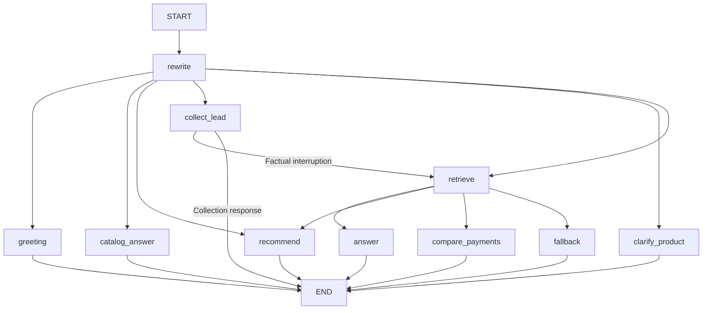

# LangGraph workflow

`AgentState` keeps accumulated messages, the rewritten query, retrieved evidence/sources, language, mode, error, the verified customer profile and lead draft/status. The current customer's boundary prevents prior customer facts from being reused after an explicit switch.

SQLite checkpoints use the conversation ID as LangGraph's `thread_id`. The browser and CLI restore this state on subsequent turns and after restart. New conversation IDs separate histories; they do not provide authentication.

The rewrite node selects the appropriate route. Catalog answers use reviewed source-linked facts; detailed questions retrieve brochure evidence. Recommendation candidates are controlled by the customer's verified goal and published entry-age limits. Payment comparisons validate supporting evidence and numerical terms. Error/fallback responses disclose insufficient evidence.

Explicit product interest enters lead mode. Missing details are requested; factual interruptions preserve the draft. Complete validated name, occupation, income and phone fields are saved through the configured SQLite tool. Success is confirmed only after a successful save.

This is a branching graph, not a graph with explicit retry cycles. Bounded extraction/answer-repair retries happen within node logic. `FlatNode` wrappers forward state and, for lead collection, configuration; they avoid unnecessary nested-graph closure inspection. See `insurex/graph.py` for the implementation.
